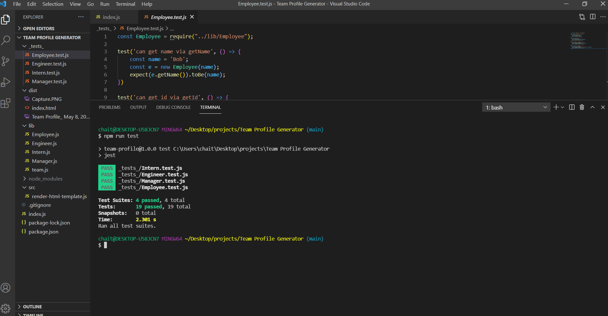
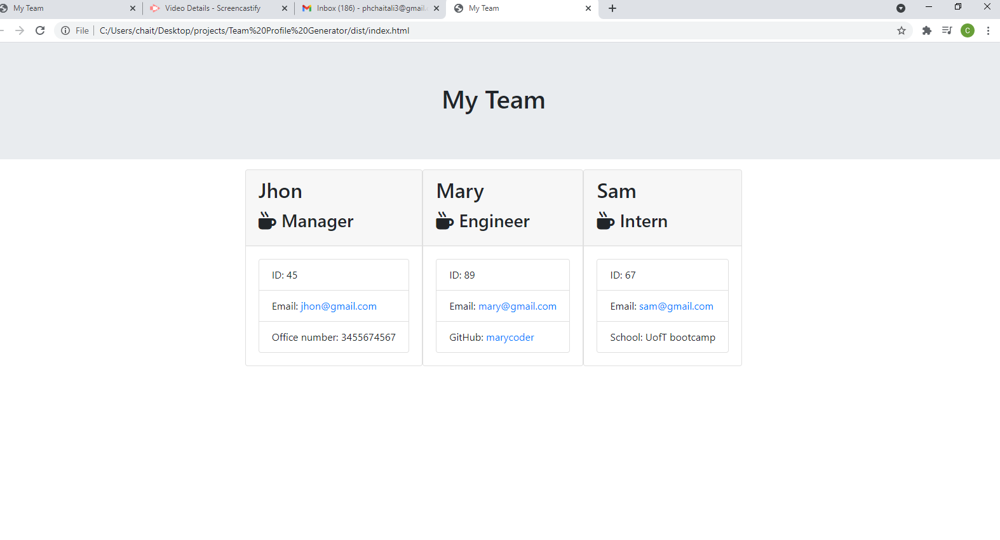

  # Team Profile Generator

  ---

  ## Description
  A team generator commmand line applications. Prompts the user for information about the team manager and then information about the team members. The user can input any number of team members, and they can be engineers and interns. When the user complete building the team, the application creates an HTML file that displays cards for all team members based on the information provided by the user. 

  ## Table of Contents
  * [Description](#description)
  * [Usage](#usage)
  * [Tests](#tests)
  * [Demo](#demo)
  
  ## Usage
  Run "node index.js" to start the application 

  ## Tests
  
 
  ## Demo
  [Video link](https://drive.google.com/file/d/1b0p3_Y7_V4vNEsIHmuFHte-wjmIqyBSI/view?usp=sharing)  
  
  ------
  
   
  
  ------
  
  [application generated HTML file](https://github.com/chaitalizn/Team-Profile-Generator/blob/9634f96b03bf5ee79c6c2902aab2a853bb612aaa/dist/index.html)  
  
  ------
  
    

  ------

  This README was generated with ❤️ by [professional-readme-generator](https://github.com/chaitalizn/professional-readme-generator)
